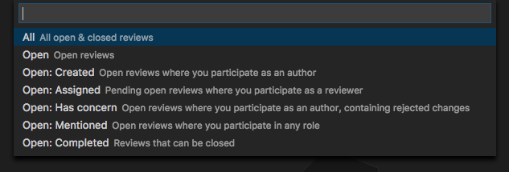

# vscode-upsource README

Provides basic interaction with your upsource reviews.


## Features

`Upsource: Setup`  
Generates an upsource.json file for use with this extension. Please setup first before using further commands.

`Upsource: Show Reviews`  
Shows a list of all reviews with certain queries.



`Upsource: Create Review`  
Create a review based on a branch or your last commit.

`Upsource: Close Review`  
Close all reviews that are ready to close.

## Settings

`upsource.checkForOpenReviewsOnLaunch`  
Checks for open reviews on launch, if upsource.json is present

`upsource.customQueries`
You're able to add custom queries to the extension. Every item in the array should have a label, description and query property. (For more information about queries, see the Upsource docs.)

Example:
```json
"upsource.customQueries": [
    {
        "label": "Concern raised",
        "description": "Reviews that have concern raised",
        "query": "#{has concern}"
    }
]
```

`upsource.defaultConfig`
Add your default config values here for faster setup. Any values provided will be pre-filled
in the setup dialog. Password is left out for security reasons.

Example:
```json
"upsource.defaultConfig": [
    {
        "url": "http://yourdomain.com/upsource",
        "login": "your@email.com",
        "projectId": "your-project",
    }
]
```

## Known Issues

Please use the github issue tracker for any encountered problems.

**Enjoy!**